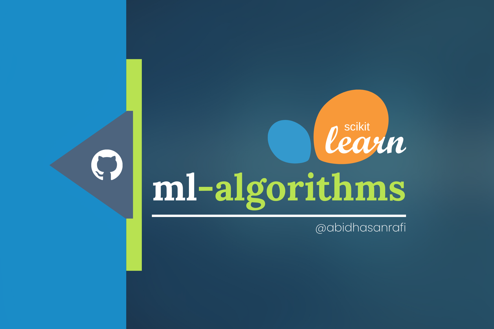

# ML-ALGORITHMS
> *- [Md. Abid Hasan Rafi](https://abidhasanrafi.github.io)*

A comprehensive, well-organized reference of machine learning algorithms available in **scikit-learn**. This repository groups estimators by learning paradigm (supervised, unsupervised, semi-supervised, neural nets, ensembles, anomaly detection) and includes essential preprocessing, feature-selection, and model-selection utilities. Each entry provides a clear starter line to introduce the algorithm and its typical use cases — ideal for educational notes, quick reference, or step-by-step examples.

## 1. Supervised Learning

### Regression Algorithms

* **Linear Regression** – *Models the linear relationship between features and a continuous target variable.*
* **Ridge Regression / RidgeCV** – *L2-regularized linear regression; RidgeCV includes built-in cross-validation for α selection.*
* **Lasso Regression / LassoCV** – *L1-regularized linear regression that promotes sparse coefficients; LassoCV for tuning.*
* **Elastic Net / ElasticNetCV** – *Combines L1 and L2 penalties for flexible regularization; ElasticNetCV tunes penalties.*
* **Bayesian Ridge Regression** – *Probabilistic linear regression that infers weight distributions with a Bayesian prior.*
* **Support Vector Regression (SVR / LinearSVR / NuSVR)** – *SVM variants for regression: kernelized SVR and linear/nu formulations for large datasets.*
* **KNeighborsRegressor / RadiusNeighborsRegressor** – *Instance-based regressors that predict from nearby samples in feature space.*
* **DecisionTreeRegressor** – *Tree-based model that splits features to predict continuous targets.*
* **RandomForestRegressor / ExtraTreesRegressor** – *Ensembles of randomized trees for robust regression.*
* **GradientBoostingRegressor / HistGradientBoostingRegressor** – *Sequential tree boosting for high-accuracy regression; histogram variant is faster on large data.*
* **AdaBoostRegressor** – *Boosting ensemble that weights hard-to-predict samples iteratively.*
* **HuberRegressor / TheilSenRegressor / RANSACRegressor** – *Robust linear estimators that reduce the influence of outliers.*
* **QuantileRegressor** – *Directly estimates conditional quantiles (useful for heteroscedastic errors and intervals).*
* **Orthogonal Matching Pursuit / LARS / LassoLars** – *Sparse linear solvers and greedy feature selection algorithms.*
* **SGDRegressor / PassiveAggressiveRegressor** – *Online/large-scale linear models using stochastic updates.*
* **GaussianProcessRegressor** – *Nonparametric probabilistic regression modeling distributions over functions.*
* **MultiOutputRegressor / RegressorChain / TransformedTargetRegressor** – *Wrappers and strategies for multi-target regression and target transformations.*

### Classification Algorithms

* **K-Nearest Neighbors (KNN) / RadiusNeighborsClassifier** – *Classify by majority vote among nearest or radius neighbors.*
* **Support Vector Classifiers (SVC / LinearSVC / NuSVC)** – *SVM classifiers: kernelized SVC and linear/nu variants for speed/control over support vectors.*
* **Logistic Regression** – *Probabilistic linear classifier for binary and multiclass problems (with regularization options).*
* **DecisionTreeClassifier** – *Interpretable tree that splits features to predict discrete labels.*
* **RandomForestClassifier / ExtraTreesClassifier** – *Bagged/randomized tree ensembles for robust classification.*
* **GradientBoostingClassifier / HistGradientBoostingClassifier** – *Boosted tree ensembles for strong predictive performance.*
* **AdaBoostClassifier** – *Boosting that increases focus on misclassified samples.*
* **Gaussian Naive Bayes / MultinomialNB / BernoulliNB** – *Probabilistic classifiers suited to continuous, count, and binary features respectively.*
* **Linear Discriminant Analysis (LDA) / Quadratic Discriminant Analysis (QDA)** – *Classic generative linear/quadratic discriminant methods for classification.*
* **SGDClassifier / PassiveAggressiveClassifier / Perceptron** – *Linear online learning algorithms for very large datasets.*
* **NearestCentroid** – *Simple classifier that assigns samples to the class of the nearest centroid.*
* **GaussianProcessClassifier** – *Probabilistic, kernel-based classifier modeling distributions over functions.*
* **CalibratedClassifierCV** – *Wrapper for calibrating classifier probabilities (Platt / isotonic methods).*
* **MultiOutputClassifier / ClassifierChain** – *Strategies/wrappers for multi-label or multi-output classification tasks.*

## 2. Unsupervised Learning

### Clustering

* **K-Means / MiniBatchKMeans** – *Centroid-based clustering; mini-batch version for speed on large data.*
* **AgglomerativeClustering (Hierarchical)** – *Bottom-up hierarchical clustering with linkage options.*
* **DBSCAN / OPTICS** – *Density-based clustering that finds arbitrary shapes and handles noise (OPTICS for variable densities).*
* **Mean Shift** – *Mode-seeking clustering by finding peaks in the density estimate.*
* **Birch** – *Scalable, incremental clustering using a CF tree for large datasets.*
* **SpectralClustering / AffinityPropagation** – *Graph-based clustering approaches for complex cluster geometry.*
* **GaussianMixture / BayesianGaussianMixture** – *Mixture models that fit data with Gaussian components, including Bayesian variants.*

### Dimensionality Reduction & Decomposition

* **PCA (Principal Component Analysis)** – *Linear dimensionality reduction that preserves variance.*
* **KernelPCA** – *Kernelized PCA for capturing nonlinear structures.*
* **IncrementalPCA / TruncatedSVD** – *Scalable or sparse-matrix decomposition (TruncatedSVD common in NLP).*
* **NMF (Non-negative Matrix Factorization)** – *Parts-based low-rank decomposition for nonnegative data.*
* **FactorAnalysis / FastICA** – *Statistical decompositions: latent factor modeling and independent components.*
* **SparsePCA / DictionaryLearning** – *Sparse and dictionary learning methods for interpretable components.*
* **t-SNE / Isomap / LocallyLinearEmbedding (LLE) / MDS / SpectralEmbedding** – *Manifold learning and nonlinear embeddings, primarily for visualization.*

## 3. Semi-Supervised Learning

* **LabelPropagation** – *Graph-based spread of labels from a small labeled set to unlabeled points.*
* **LabelSpreading** – *Variant that uses a normalized graph Laplacian for smoother propagation.*

## 4. Neural Network Models

* **MLPClassifier** – *Feedforward multi-layer perceptron for classification; supports multiple hidden layers, different activations, and solvers.*
* **MLPRegressor** – *Feedforward multi-layer perceptron for regression tasks.*

> *Note: scikit-learn’s MLPs are suitable for moderate-size feedforward networks. For deep learning or advanced neural architectures, prefer frameworks such as PyTorch or TensorFlow.*

## 5. Ensemble & Meta-Estimators

* **BaggingClassifier / BaggingRegressor** – *Bootstrap aggregation of base estimators.*
* **RandomForestClassifier / RandomForestRegressor** – *Bagged trees with feature randomness.*
* **ExtraTreesClassifier / ExtraTreesRegressor** – *Extremely randomized trees for faster, lower-variance ensembles.*
* **GradientBoostingClassifier / Regressor** – *Stagewise additive modelling using decision trees as weak learners.*
* **HistGradientBoostingClassifier / Regressor** – *Histogram-based gradient boosting optimized for speed and memory.*
* **AdaBoostClassifier / Regressor** – *Adaptive boosting that reweights training samples.*
* **VotingClassifier / Regressor** – *Combine heterogeneous models by voting or averaging.*
* **StackingClassifier / Regressor** – *Meta-learner trained on base models’ predictions.*
* **ClassifierChain / RegressorChain** – *Chain strategy for multi-output tasks that models label dependencies.*
* **CalibratedClassifierCV** *(relisted here as meta-estimator)* – *Probability calibration wrapper for improved probabilistic outputs.*

## 6. Anomaly Detection / Outlier Detection

* **IsolationForest** – *Detects anomalies by isolating points using random partitioning trees.*
* **LocalOutlierFactor (LOF)** – *Density-based local anomaly detection via neighbor density deviation.*
* **OneClassSVM** – *Learns a boundary around normal data for novelty detection.*
* **EllipticEnvelope** – *Assumes multivariate Gaussian distribution to find outliers.*

## 7. Model Selection, Preprocessing & Feature Tools

### Preprocessing & Transformers

* **StandardScaler / MinMaxScaler / RobustScaler / MaxAbsScaler** – *Scaling strategies for numeric features.*
* **PowerTransformer / QuantileTransformer / FunctionTransformer** – *Distribution transforms and custom feature transforms.*
* **OneHotEncoder / OrdinalEncoder / LabelEncoder** – *Encoding categorical variables.*
* **Binarizer / KBinsDiscretizer** – *Binarize or discretize continuous features.*
* **PolynomialFeatures / Interaction terms** – *Generate polynomial and interaction features.*
* **SimpleImputer / IterativeImputer / KNNImputer** – *Missing value imputation strategies.*
* **ColumnTransformer / FeatureUnion / Pipeline** – *Compose feature pipelines and parallel transforms for clean workflows.*
* **SelectFromModel / SelectKBest / VarianceThreshold / RFE / RFECV** – *Feature selection and recursive elimination strategies.*

### Model Selection & Cross-Validation

* **train_test_split / Cross-Validation (KFold, StratifiedKFold, GroupKFold, TimeSeriesSplit)** – *Data splitting and CV strategies.*
* **GridSearchCV / RandomizedSearchCV / HalvingGridSearchCV / Bayes-style search wrappers** – *Hyperparameter tuning and search.*
* **Pipeline integration with GridSearch** – *Search hyperparameters across preprocessing and estimator steps.*
* **Scoring metrics and custom scorers** – *Plugable evaluation metrics for search and reporting.*